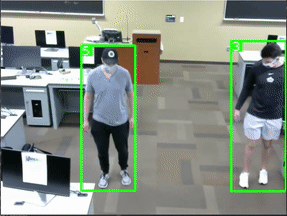

# COVID-19-Social-Distancing-Monitor
**Project Team:** Erich Choudhury, Connor Bowler, Alex Wirtz
**Supervisor:** Dr. Hamed Tabkhi
**Date:** May 13, 2021

This is the final project for Real Time AI at UNCC, Spring 2021. This implementation is based off of [Mikel Brostrom's YOLOv5_DeepSort_Pytorch](https://github.com/mikel-brostrom/Yolov5_DeepSort_Pytorch) project.

This project is a near real time COVID-19 social distance monitoring system the uses pre-existing libraries to help with estimating distances between objects and verifying social distancing guideline in order to create a safer, healthier public. It will also assist in visualizing if two people are too close together. 

